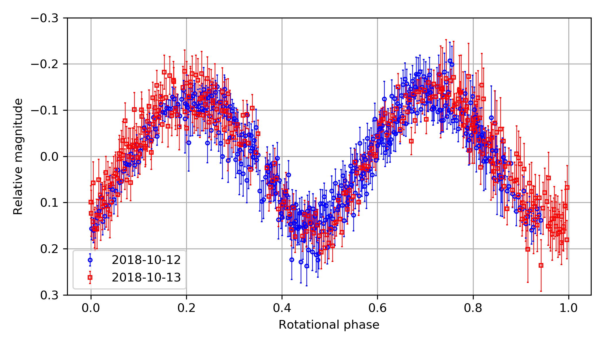

## Problem Set 05 [40 points]

### Instructions

Please use python 3.6+ (Never use python 2). 

For other packages: Although I didn't run all the tests, likely there will be no problem if you use decently recent versions of any packages used in the homework (any version released after 2017).

Here we will learn how to code in _pythonic_ way. Start solving the problems after running the code below:

```python
import numpy as np
import pandas as pd
from matplotlib import pyplot as plt

plt.style.use('default')
np.random.seed(123)
data_str = '''jd_target,m_red,dm_red,serious
    2458403.9602,17.1008,0.0738,0
    2458403.9722,17.1255,0.0429,0
    2458403.9842,17.1770,0.0420,0
    2458403.9961,17.2755,0.0412,0
    2458404.0081,17.3114,0.0435,0
    2458404.0201,17.3947,0.0377,0
    2458404.0321,17.2879,0.0340,0
    2458404.0440,17.2120,0.0312,0
    2458404.0560,17.0571,0.0277,0
    2458404.0680,17.0799,0.0277,0
    2458404.0800,17.0958,0.0272,0
    2458404.0920,17.1262,0.0271,0
    2458404.1040,17.2231,0.0304,0
    2458404.1159,17.3279,0.0312,0
    2458404.1401,17.2705,0.0277,0
    2458404.1521,17.1999,0.0222,0
    2458404.1641,17.0976,0.0209,0
    2458404.1761,17.0944,0.0228,0
    2458404.1881,17.0537,0.0249,0
    2458404.2001,17.0836,0.0249,0
    2458404.2122,17.1790,0.0245,1
    2458404.2242,17.2610,0.0303,0
     '''
```

While answering the problems, follow these rules:

1. You **should not import any other packages**.
2. For each problem, I gave hints. **It is also homework for you to search for those on google**.

### Problems

The ``data_str`` is the photometry results of an asteroid (155140) 2005 UD taken at the SNU Astronomical Observatory (SNUO or SAO) 1-m telescope. I selected only 22 data points out of 811 data points. ``jd_target`` is roughly the observation time in JD, ``m_red`` is the reduced magnitude (please regard it as the magnitude of the asteroid), ``dm_red`` is the error of it, and ``serious`` is 1 if the image had serious problem, so should not be used.


[2 points each]

You can fill in the ``?`` parts in the Hints and use that to answer the questions. Or, you can just make your own answer, ignoring the Hints.

1. Make a DataFrame from ``data_str``. Give it a name ``df``.
   * Hint: ``pd.read_csv(pd.compat.StringIO(?))``

2. Print the first 3 rows of the ``df``.
   * Hint: use ``.head()``
3. Print the last 3 rows of the ``df``.
   * Hint: use ``.tale()``
4. See ``df.describe()``. What is the roughly estimated mean magnitude?
5. Print the latex code for the data to make a table.
   * Hint: use ``print(df.to_latex(index=False))``
   * There are other conversions, to HTML, numpy, etc.
6. Check whether the unique elements of the column ``serious`` are 0 and 1.
   - Hint: use ``.unique()`` to the column.
7. To get an idea how the data looks like, plot the error-bar of the ``m_red`` as a function of JD.
   * Hint: ``plt.errorbar(df["jd_target"], df["?"], df["dm_red"])``
8. The error-bar of magnitude is not Gaussian, but the error-bar of flux is nearly Gaussian. In usual photometry, what we get is the flux error but we only present the magnitude error which is calculated (estimated) from the flux error. From the ``dm_red``, recover the error-bar of the flux.
   * Hint: The flux error and magnitude errors are related by ``dm = 2.5 / np.log(10) * dflux``. 
   * Hint: The inversion of the equation may give ``df["dflux"] = ? * df["dm_red"]``
9. Actually, ``"dflux"`` column is useless. Remove this column.
   * Hint: Use ``.drop(columns=["dflux"], inplace=?)``. 
   * The ``inplace`` option can either be ``True`` or ``False``, depending on how you do (if you can't understand it, Google it!)
10. Make a mask to mask rows with ``serious==1``. Name it ``mask_serious``.
    * Hint: ``df["serious"]==1``

11. Replace the ``dm_red`` of the masked row as ``NaN``.
    * Hint: Use ``df.loc[mask, "dm_red"]``
12. You found that, for some reason, the 3th row is problematic. Replace ``"m_red"`` of this row to ``NaN``.
    * Hint: Use ``df.loc[3, "m_red"]`` or ``df.iloc[3, 1]``.
13. Drop any row which contains any NaN values.
    * Hint: Use ``df.dropna(inplace=?)``
14. If you see ``df``, the index (leftmost column) is missing ``3`` and ``20``. Reset this such that it is consecutive integers of separation 1.
    * Hint: ``df.reset_index(inplace=?, drop=True)``
15. From Ishiguro et al. 2019, it is found the period of the asteroid is 0.218282 +/- 0.000092 day. Add a column called ``"phase"``.
    * Hint: Use ``df["jd_target"]%0.218282 / 0.218282``
16. Make a column ``"first_half"``, and assign ``True`` if phase is smaller than 0.5, and ``False`` otherwise.
    * Hint: ``df["first_half"] = df["phase"] < 0.5``
17. Make a column ``"faint"``, and assign ``True`` if ``m_red`` is larger(fainter) than the mean calue, and ``False`` otherwise.
    * Hint: ``df["faint"] = df["m_red"] > df["m_red"].mean()``
18. Make ``DataFrameGroupBy`` object based on the columns ``["first_half", "faint"]``.


[4 points]

19. Fill in the following code to plot a graph such that the marker is 

    1. red when ``first_half==True`` and blue otherwise, 
    2. empty inverse triangle (``"v"``) when ``faint=True`` and filled triangle (``"^"``) otherwise

    and the y-axis decreases as go upward (lower 17.5, upper 17.0), because it's magnitude.

    ```python
    #        first  faint
    props = {(True, True): dict(marker="v", color="r", mfc="none"),
             (True, False): dict(marker="^", color="r"),
             (False, True): dict(marker="v", color="b", mfc="none"),
             (False, False): dict(marker="^", color="b")
            }
    
    fig, axs = plt.subplots(1, 1, figsize=(6, 4), sharex=False, sharey=False, gridspec_kw=None)
    
    for (first, faint), g in grouped:
        axs.errorbar(g["phase"], g["m_red"], yerr=g["dm_red"], 
                     **props[(?, ?)], ls='', ms=10)
    
    axs.set(ylim=(?, 17),
            xlabel="Phase", ylabel="Reduced magnitude")
    axs.grid()
    plt.tight_layout()
    plt.show()
    ```

    

**TIP**

There are some occasions when it's better to use ``for`` than simple ``df["blahblah"] = df["col1"] * df["col2"]``, especially when complicated calculation is needed. In such cases, you can use

```python
for i, row in df.iterrows():
    first_half = row["phase"] < 0.5
    df.at[i, "first_half"] = first_half
```

Things go well in this case with ``loc``, but I used ``at``.
* ``loc`` is slower, but you can access to multiple locations
* ``at`` is quicker, but you can access to only one single location

See [here](https://stackoverflow.com/questions/37216485/pandas-at-versus-loc)


The full light curve of this asteroid, from the 2-night observation at SNU is like this:



