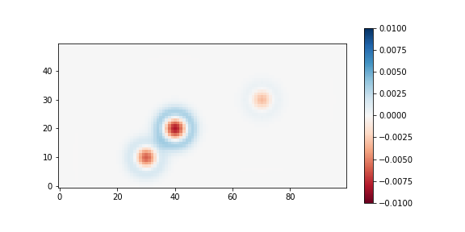

## Problem Set 07 [50 points]

### Instructions

Please use python 3.6+ (Never use python 2). 

For other packages: Although I didn't run all the tests, likely there will be no problem if you use decently recent versions of any packages used in the homework (any version released after 2017).

Here we will learn how to use ``astropy.fits``. Please run the following code before you start:

```python
from pathlib import Path
import numpy as np
from astropy.io import fits
from astropy.modeling.functional_models import Gaussian2D
from astropy.nddata import CCDData
from photutils.psf import IntegratedGaussianPRF
from matplotlib import pyplot as plt

np.random.seed(123)
top = Path('tmp')
top.mkdir(exist_ok=True)
final_image = np.zeros((50, 100))
bias_adu = 1000      # ADU
sens_center_xy = (90, 30)
sens_sigma = 100     # pixel 
dark_epsec = 0.1     # epsec = e/sec = electron per second (per pixel)
exptime = 300        # seconds
gain_epadu = 1.36    # epadu = e/ADU = electron per ADU
rdnoise_e = 9.0      # electrons
seeing_arcsec = 2.5  # arcsec (FWHM)
pixel_scale = 0.9    # arcsec per pixel
skylevel_e = 500     # electrons

# Stars' properties. 
#   Flux = integrated flux in electrons, 
#   x_0/y_0 = center positions in pixel
stars_props = dict(A=dict(flux=70000, x_0=40, y_0=20),
                   B=dict(flux=30000, x_0=30, y_0=10),
                   C=dict(flux=10000, x_0=70, y_0=30)
                   )

def add_rdnoise(image_adu, rdnoise_e, gain_epadu):
    ''' Adds readnoise
    Parameters
    ----------
    image_adu : array-like
        The image to add readnoise, in ADU unit.
    rdnoise_e, gain_epadu : float
        The readnoise and gain in electrons and electrons per ADU, respectively.

    Return
    ------
    _result : ndarray
        The noise-added image.
    '''
    rdnoise = np.random.normal(loc=0, scale=rdnoise_e, size=image_adu.shape)
    _result = image_adu + rdnoise / gain_epadu
    return _result

```

While answering the problems, follow these rules:

1. You **should not import any other packages**.
2. You **should not define any functions.**
3. For each problem, I gave hints. **It is also homework for you to search for those on google**.

### Problems

The final raw image (``final_image``) will have the following header:

```
SIMPLE  =                    T / conforms to FITS standard                      
BITPIX  =                   16 / array data type                                
NAXIS   =                    2 / number of array dimensions                     
NAXIS1  =                  100                                                  
NAXIS2  =                   50                                                  
OBJECT  = '2019AO2test'        / The observed target                            
BUNIT   = 'adu     '           / Pixel value unit                               
IMAGETYP= 'Light Frame'        / Type of image
EXPTIME =                300.0 / [s] Exposure time
GAIN    =                 1.36 / [e-/ADU] The electron gain factor.             
RDNOISE =                  9.0 / [e-] The (Gaussian) read noise.                
```

[2 points each]

1. Make a bias map called ``bias``, assuming the mean bias level is 1000 ADU.

   - Hint: Pure bias map must be a constant, so ``bias = np.ones_like(?) * bias_adu``

2. Add readnoise to ``bias`` using ``add_rdnoise``.

   * Hint: Just use ``bias = add_rdnoise(image_adu=bias, rdnoise_e=rdnoise_e, gain_epadu=gain_epadu)``.

3. Check that ``np.mean(bias)`` is as you expected.

4. Save this ``bias`` as a FITS file to ``top/'bias.fits'`` which resembles the ``final_image``'s header above.

   * Hint: Use the following

   * ```python
     bias_hdu = fits.PrimaryHDU(bias.astype('int16'))
     bias_hdu.header["BUNIT"] = ("adu", "Pixel Unit Value")
     bias_hdu.header["OBJECT"] = ("bias", "The observed target")
     bias_hdu.header["EXPTIME"] = (0, '[s] Exposure time')
     bias_hdu.header["IMAGETYP"] = ('Bias Frame', 'Type of image')
     bias_hdu.header["GAIN"] = (1.36, '[e-/ADU] The electron gain factor.')
     bias_hdu.header["RDNOISE"] = (9.0, '[e-] The (Gaussian) read noise.')
     bias_hdu.writeto(top/"bias.fits")
     ```

5. Make a dark frame called ``dark_300s``, from ``exptime`` and ``dark_epsec``, and assuming dark current is Poissonian.

   * Hint: ``dark_300s = np.random.poisson(dark_epsec * ?, size=final_image.shape)`` .

5. Add readnoise to ``dark_300s`` using ``add_rdnoise`` and overwrite ``dark_300s``.

   * Hint: ``dark_300s = add_rdnoise(image_adu=dark_300s/?, rdnoise_e=rdnoise_e, gain_epadu=gain_epadu)``

6. Check that ``np.mean(dark_300s)`` is as you expected.

7. Save ``dark_300s`` as a FITS file to ``top/'dark_300.fits'`` which resembles the ``final_image``'s header above.

   * Hint: Use the following

   * ```python
     dark_hdu = fits.PrimaryHDU(dark_300s.astype(?))
     dark_hdu.header["BUNIT"] = (?, "Pixel Unit Value")
     dark_hdu.header["OBJECT"] = ("dark", "The observed target")
     dark_hdu.header["EXPTIME"] = (?, '[s] Exposure time')
     dark_hdu.header["IMAGETYP"] = ('Dark Frame', 'Type of image')
     dark_hdu.header["GAIN"] = (1.36, '[e-/ADU] The electron gain factor.')
     dark_hdu.header["RDNOISE"] = (9.0, '[e-] The (Gaussian) read noise.')
     dark_hdu.writeto(top/?)
     ```


Consider the vignetting (sensitivity or the "flat") is in the form of a circular Gaussian, centered at ``sens_center_xy`` and standard deviation ``sens_sigma`` pixel. Let's make the flat map based on these.

9. First, make meshgrid ``xx`` and ``yy``, which will contain the x and y values for each of the ``(50, 100)`` pixels. The resulting ``xx`` and ``yy`` will have the same shape as ``(50, 100)``.
   
* Hint: Use ``np.mgrid[] ``, i.e., ``yy, xx = np.mgrid[:final_image.shape[?], :final_image.shape[?]]`` 
  
10. Check ``xx`` indeed is the x-values of the ``(50, 100)``-shaped image.
11. Make the r-square map called ``rsq``, which is of shape ``(50, 100)`` and contains the distance from the position ``sens_center_xy``. 
    
    * Hint: ``rsq = (xx - sens_center_xy[?])**2 + (yy - sens_center_xy[?])**2``
12. Finally, use the Gaussian function to make the sensitivity map.
    * Hint: ``sens = np.exp(-? / (2 * ?**2))``.
    * If you want to view the flat pattern, you can do ``plt.imshow(sens, origin='lower')``.

13. Save ``sens`` as a FITS file to ``top/'flat.fits'`` which resembles the ``final_image``'s header above.

    * Hint: Use the following

    * ```python
      sens_hdu = fits.PrimaryHDU(sens.astype('float32'))
      sens_hdu.header["BUNIT"] = ('dimensionless', "Pixel Unit Value")
      sens_hdu.header["OBJECT"] = ("flat", "The observed target")
      sens_hdu.header["EXPTIME"] = (300, '[s] Exposure time')
      sens_hdu.header["IMAGETYP"] = ('Light Frame', 'Type of image')
      sens_hdu.header["GAIN"] = (1.36, '[e-/ADU] The electron gain factor.')
      sens_hdu.header["RDNOISE"] = (9.0, '[e-] The (Gaussian) read noise.')
      sens_hdu.writeto(top/?)
      ```


Let's now add three stars. The seeing FWHM is ``seeing_arcsec`` in arcsecond and the pixel scale is ``pixel_scale`` (arcsec/pixel). Assume circular Gaussian PSF. 

14. Prove that the FWHM of a circular Gaussian profile is $\mathrm{FWHM} = 2\sqrt{2\ln 2} \sigma$ for standard deviation $\sigma$.
    * Hint: Gaussian profile has $f(r|A,\, \sigma) = A e^{-r^2/2\sigma^2}$ and the FWHM is defined as $f(r=\mathrm{FWHM}/2) = A/2$.
    * **Just answer "I did"**. No need to provide equations. 

15. Fill in the blanks to make the image of stars.

12. ```python
    stars = np.ones_like(final_image) * skylevel_e  # Initialize with sky values
    seeing_sigma_pix = seeing_arcsec / pixel_scale
    
    for _, prop in stars_props.items():
        g = IntegratedGaussianPRF(**prop, sigma=?)
        stars += g(xx, ?)  # Add the star to stars
        
    stars = np.random.poisson(stars) / ?  # Poissonian sample and convert to ADU
    ```

    * You can check the results by ``plt.imshow(stars, origin='lower')``

16. Make a new bias and dark. Using the previously made flat (``sens``), simulate a raw image (bias, dark added, flat pattern added, and add readnoise).
    * Hint: The exposure time is 300s as described in the beginning of this homework.
    * Hint: Make bias and dark as before, but do not add readnoise yet. 
    * Hint: Then ``stars_adu = bias + (dark + sens*stars)/?``.
    * Hint: Add readnoise now by ``stars_adu = add_rdnoise(image_adu=stars_adu, rdnoise_e=rdnoise_e, gain_epadu=gain_epadu)``

17. Save ``stars_adu`` as a FITS file to ``top/'image0001.fits'`` which resembles the ``final_image``'s header above.

    * Hint: Use the following (This is the ``final_image``, so look at the sample header in the beginning of this homework):

    * ```python
      stars_hdu = fits.PrimaryHDU(stars_adu.astype('int16'))
      stars_hdu.header["BUNIT"] = (?, "Pixel Unit Value")
      stars_hdu.header["OBJECT"] = (?, "The observed target")
      stars_hdu.header["EXPTIME"] = (?, '[s] Exposure time')
      stars_hdu.header["IMAGETYP"] = ('Light Frame', 'Type of image')
      stars_hdu.header["GAIN"] = (1.36, '[e-/ADU] The electron gain factor.')
      stars_hdu.header["RDNOISE"] = (9.0, '[e-] The (Gaussian) read noise.')
      stars_hdu.writeto(top/?)
      ```

18. Now, load all the four FITS files using the following code:

    ```python
    master_paths = dict(bias=top/"bias.fits",
                           dark=top/"dark_300.fits",
                           flat=top/"flat.fits")
    master_frames = {}
    for k, v in master_paths.items():
        master_frames[k] = fits.open(?)[?]
    
    rawim = fits.open(top/"image0001.fits")[0]
    ```

19. Do bias, dark, and flat corrections.

    * Hint: Use the following:

    * ```python
      hdr = rawim.header.copy()
      try: 
          _ = hdr["PROCESS"]
      except KeyError:
          hdr["PROCESS"] = ''
      
      # Bias subtraction
      rawim_reduced = rawim.data - master_frames['bias'].data
      hdr["PROCESS"] += "B"
      hdr.add_history(f"Bias subtracted by {master_paths['bias']}")
                      
      hdu = fits.PrimaryHDU(data=rawim_reduced, header=hdr)
      hdu.writeto(top/"image0001_bxx.fits", overwrite=True)
                      
      # Dark subtraction
      #   NOTE: our dark is already bias subtracted!
      dark_exptime = master_frames['dark'].header['EXPTIME']
      targ_exptime = hdr[?]
      dark = master_frames['dark'].data
      if targ_exptime == dark_exptime:
          rawim_reduced = rawim_reduced - dark
      else:
          print("No corresponding dark frame found; "
                + f"Scaling it from {dark_exptime}.")
          rawim_reduced = rawim_reduced - dark * (targ_exptime/dark_exptime)
      hdr["PROCESS"] += "D"
      hdr.add_history(f"Dark subtracted by {master_paths['dark']}")
      
      hdu = fits.PrimaryHDU(data=?, header=?)
      hdu.writeto(top/"image0001_bdx.fits", overwrite=True)
      
      # Flat correction
      #   NOTE: our flat is already bias and dark subtracted!
      flat_mean = np.mean(master_frames['flat'].data)
      flat_norm = master_frames['flat'].data / flat_mean
      rawim_reduced = rawim_reduced / flat_norm
      hdr["PROCESS"] += ?
      hdr.add_history(f"Flat corrected by {master_paths['flat']} (flat mean={?})")
      
      hdu = fits.PrimaryHDU(data=rawim_reduced.astype(?), header=hdr)
      hdu.writeto(top/"image0001_bdf.fits", overwrite=True)
      ```

      Fill in the blanks such that ``image0001_bdf.fits`` has the following header:

      ```python
      SIMPLE  =                    T / conforms to FITS standard                      
      BITPIX  =                  -32 / array data type                                
      NAXIS   =                    2 / number of array dimensions                     
      NAXIS1  =                  100                                                  
      NAXIS2  =                   50                                                  
      BUNIT   = 'adu     '           / Pixel Unit Value                               
      OBJECT  = '2019AO2test'        / The observed target                            
      EXPTIME =                  300 / [s] Exposure time                              
      IMAGETYP= 'Light Frame'        / Type of image                                  
      GAIN    =                 1.36 / [e-/ADU] The electron gain factor.             
      RDNOISE =                  9.0 / [e-] The (Gaussian) read noise.                
      PROCESS = 'BDF     '                                                            
      HISTORY Bias subtracted by tmp/bias.fits                                        
      HISTORY Dark subtracted by tmp/dark_300.fits                                    
      HISTORY Flat corrected by tmp/flat.fits (flat mean=0.8796451091766357) 
      ```

20. Display the images. Do you see the effect of reduction?

    ```python
    fig, axs = plt.subplots(3, 1, figsize=(6, 7), sharex=False, sharey=False, gridspec_kw=None)
    
    for i, fpath in enumerate([top/"image0001.fits", 
                               top/"image0001_bdx.fits", 
                               top/"image0001_bdf.fits"]):
        data = fits.getdata(fpath)
        vmin, vmax = np.percentile(data, [1, 99])
        axs[i].imshow(data, origin='lower', vmin=vmin, vmax=vmax)
        axs[i].set(title=fpath)
    plt.tight_layout()
    plt.show()
    ```

21. Delete your files and directory.


[4 points]

In the above, we used ``IntegratedPRF``, which has slightly different meaning than PSF in ``photutils``. Gaussian function will calculate the pixel value as the Gaussain function value at the pixel center ($f(x_i, y_i)$ for the i-th pixel), while ``IntegratedPRF`` is the **integrated** value of the Gaussian function values within the pixel $\left( \int_{x_i - \Delta x/2}^{x_i + \Delta x/2} \int_{y_i - \Delta y/2}^{y_i + \Delta y/2} f(x, y) dx dy \right)$. To see the difference, we need a test.

22. Fill in the blanks to see the map of $\frac{\mathrm{IntegratedPRF~case}-\mathrm{SimpleGaussian~case}}{\mathrm{\mathrm{IntegratedPRF~case} + \mathrm{sky}}}$ (there's no sky in the numerator because they cancel out):

14. ```python
    # Here, no noise will be added, because the purpose is to see the difference 
    # (between Integrated PRF and simple Gaussian function value)
    stars_psf = np.zeros_like(final_image)  # Simple function value case
    stars_int = np.zeros_like(final_image)  # Integrated value case
    
    seeing_sigma_pix = seeing_arcsec / pixel_scale
    seeing = dict(x_stddev=seeing_sigma_pix, y_stddev=seeing_sigma_pix)
    
    for _, prop in stars_props.items():
        amp = prop["flux"] / (2*np.pi * seeing_sigma_pix**2)
        g_psf = Gaussian2D(amplitude=amp, 
                           x_mean=prop[?], 
                           y_mean=prop[?], 
                           **seeing)
        g_int = IntegratedGaussianPRF(**prop, sigma=seeing_sigma_pix)
        stars_psf += g_psf(xx, yy)
        stars_int += g_int(xx, yy)
        
    fig, axs = plt.subplots(1, 1, figsize=(8, 4))
    diff = (stars_int - stars_psf) / (stars_int + skylevel_e)  
    
    im = axs.imshow(diff, origin='lower', vmin=-0.01, vmax=0.01, cmap='RdBu')
    plt.colorbar(im)
    print(np.sum(stars_psf), np.sum(stars_int))
    ```

In the code, the resulting image will show the fractional difference, assuming the sky was ``skylevel_e = 500`` electrons. You can see the difference is large near the center and outskirt of the stars, although **each star's total flux is the same** for both cases. 



[4 points]

Now let's see how it changes for the sky level.

23. Fill in the blanks:

```python
# Here, no noise will be added, because the purpose is to see the difference 
# (between Integrated PRF and simple Gaussian function value)
seeing_sigma_pix = seeing_arcsec / pixel_scale
seeing = dict(x_stddev=seeing_sigma_pix, y_stddev=seeing_sigma_pix)

mins = []
maxs = []
skylevels = np.arange(0.1, 1000, 200)

print("skylevel electrons: min difference, max difference")
for skylevel in ?:
    stars_psf = np.zeros_like(final_image)  # Simple function value case
    stars_int = np.zeros_like(final_image)  # Integrated value case
    for _, prop in stars_props.items():
        amp = prop["flux"] / (2*np.pi * seeing_sigma_pix**2)
        g_psf = Gaussian2D(amplitude=amp, 
                           x_mean=prop[?], 
                           y_mean=prop[?], 
                           **seeing)
        g_int = IntegratedGaussianPRF(**prop, sigma=seeing_sigma_pix)
        stars_psf += g_psf(xx, yy)
        stars_int += g_int(xx, yy)
    diff = (stars_int - stars_psf) / (stars_int + ?)  
    vmin = 100*np.min(diff)
    vmax = 100*np.max(diff)
    mins.append(vmin)
    maxs.append(vmax)
    print("{:18.0f}: {:^13.5f}%, {:^13.5f}%".format(skylevel, ?, ?))

fig, axs = plt.subplots(1, 1, figsize=(7, 5))
axs.plot(skylevels, mins)
axs.plot(skylevels, maxs)
axs.set(xlabel='skylevel [electrons]', ylabel='min/max difference [%]')
plt.tight_layout()
plt.show()
```


The importance of this difference depends on the situation. If you just want a simple rough fitting to the profile, both will give similar results (centroid position, FWHM, etc). But if you want to get accurate PSF, it is better to choose Integrated version. 


